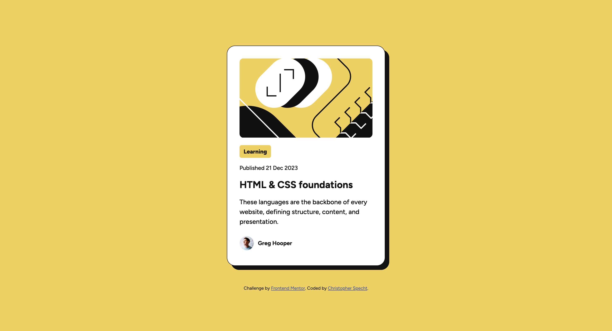
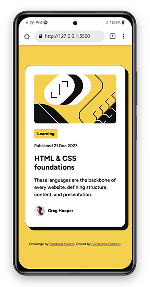

# Frontend Mentor - Blog preview card solution

This is a solution to the [Blog preview card challenge on Frontend Mentor](https://www.frontendmentor.io/challenges/blog-preview-card-ckPaj01IcS). Frontend Mentor challenges help you improve your coding skills by building realistic projects.

## Table of contents

- [Overview](#overview)
  - [The challenge](#the-challenge)
  - [Screenshot](#screenshot)
  - [Links](#links)
- [My process](#my-process)
  - [Built with](#built-with)
  - [What I learned](#what-i-learned)
  - [Continued development](#continued-development)
  - [Useful resources](#useful-resources)
- [Author](#author)
- [Acknowledgments](#acknowledgments)

## Overview

### The challenge

Users should be able to:

- See hover and focus states for all interactive elements on the page

### Screenshot

### Links

- Solution URL: [Solution](https://github.com/ctspecht12/FM-Blog-preview-card)
- Live Site URL: [Live Site](https://ctspecht12.github.io/FM-Blog-preview-card)

## My process

Started by defining elements in the html and then styled the desktop version as closely as possible referencing the preview jpg. Finally added @media styles to make responsive.

### Built with

- Visual Studio Code

### What I learned

Not much new this time, but I got some more practice using flexbox and am getting faster with each project.

### Continued development

Continue practicing to maintain and increase fluency.

## Author

- Frontend Mentor - [@ctspecht12](https://www.frontendmentor.io/profile/ctspecht12)
